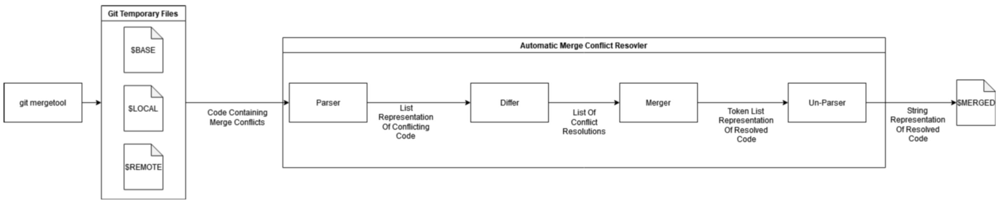

# automatic-merge-conflict-resolver
Automatic Merge Conflict Resolver (AMCR) is a program that automatically resolves git merge conflicts. AMCR handles common merge conflicts locally, and calls upon GPT-3 to resolve complex merge conflicts that cannot be handled locally.

Every developer has felt the so-called “merge conflict panic”: your code works well, but when you merge it into the main branch, you get a merge conflict and your code is now full of conflict markers. Many of these merge conflicts are straightforward and thus can be resolved automatically. AMCR uses pattern matching to identify certain merge conflict types, then a handler resolves the merge conflict and writes the result to the original file. If a merge conflict is too complex and does not match the types of conflicts AMCR can handle, a query is made to a large language model (GPT-3) which will attempt to resolve it. This tool significantly enhances developers' efficiency by eliminating the need for manual intervention in resolving each merge conflict, thereby streamlining a traditionally repetitive task.

# Setup
1. Run the following command in the root directory:
```git config --local include.path ../.gitconfig```

2. Install the packages in requirements.txt: 
```pip install -r requirements. txt```

3. Provide your OpenAI key:
```export OPENAI_API_KEY="YOUR_KEY_HERE"```

4. Alternatively, if you do not have OpenAI API access, configure ChatGPT-Wrapper:
```chatgpt install```

# Usage
After obtaining a merge conflict, run this command:
```git mergetool -t amcr```

You also specify a path to resolve a conflict in a specific file or folder:
```git mergetool -t amcr "PATH/TO/FILE/WITH/MERGE/CONFLICT.py"```

# Development
An alias is included to speed up development and testing. It aborts the merge, starts a new merge, then runs the mergetool:
```bash mergeAlias.sh```

# Architecture



# Testing
To run tests, execute ```pytest``` from the home directory.

Files that make it easy to create test merge conflicts are found in src/tests.
